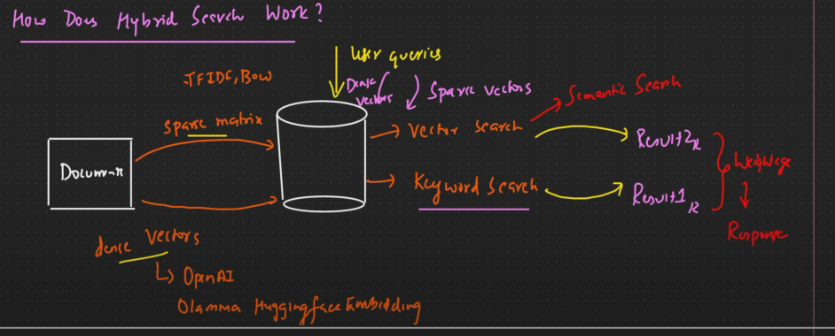
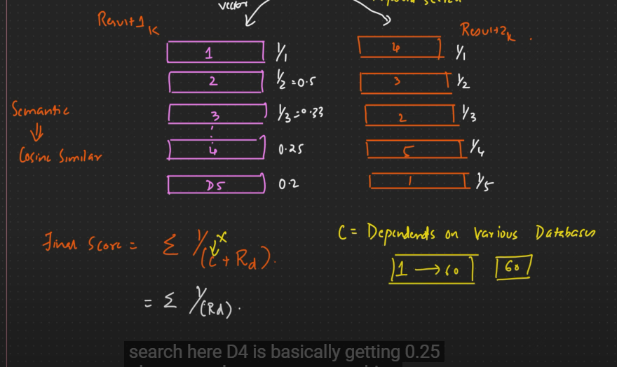
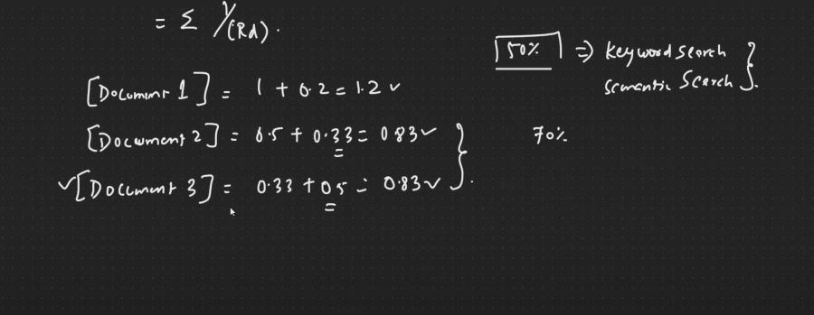
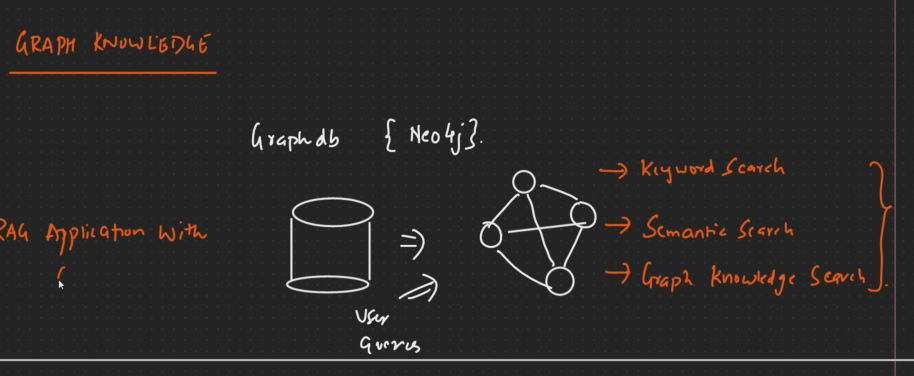

## Hybrid search work
-> In hybrid search we use both syntax and semantic search .

 -**Technique of combining weightage and response** 
 -> That is reciprocal rank fusion in Hybrid Search

## Reciprocal Rank Fusion in Hybrid Search

then

## Graph Knowledge 
