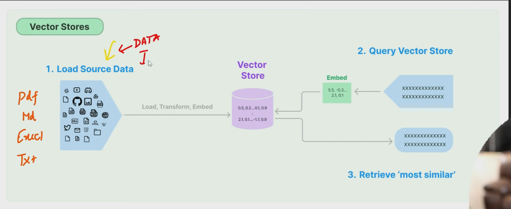

## RAG Pipeline

## Overview

The RAG (Retrieval-Augmented Generation) Pipeline is an advanced system designed for the efficient management and retrieval of large-scale data through the use of vector embeddings. This pipeline transforms raw data from various sources into vector representations, stores these vectors in a vector database, and enables the querying and retrieval of the most relevant data based on contextual similarity.

## Table of Contents
1. [Features](#features)
2. [Architecture](#architecture)

## Features

- **Data Ingestion**: Supports various data formats including PDFs, Markdown, Excel, and plain text.
- **Data Transformation**: Converts data into manageable chunks and embeds them into vector representations.
- **Vector Storage**: Efficiently stores vector embeddings in a vector database.
- **Contextual Querying**: Allows for sophisticated querying to retrieve the most contextually relevant data.

## Architecture

The RAG pipeline architecture consists of several interconnected components designed to handle the end-to-end process of data ingestion, transformation, vector embedding, storage, and querying. Here, we will delve deeper into each component and its functionalities.

### 1. Load Source Data: Data Ingestion Tool

**Purpose**: The primary role of the data ingestion tool is to gather and preprocess data from various sources to make it suitable for further processing.

#### Components:

- **Source Connectors**:
  - These are modular components that connect to different data sources like PDF files, Markdown files, Excel sheets, and plain text files.
  - **Function**: Extract raw data from these sources.

- **Preprocessing Module**:
  - **Function**: Clean, normalize, and standardize the raw data. This may include tasks such as:
    - Removing noise (e.g., irrelevant information, special characters).
    - Normalizing text (e.g., lowercasing, removing stop words).
    - Handling missing values or incomplete data.

- **Chunking Module**:
  - **Function**: Breaks down the preprocessed data into smaller, manageable chunks. The chunking size is determined based on the context needed for effective embedding.
  - **Context Size**: The size of each chunk is crucial as it impacts the quality of the embedding. It balances between too granular (losing context) and too broad (losing specificity).

### 2. Data Transformation and Embedding

**Purpose**: Transform the chunks of data into vector embeddings that capture their semantic meaning.

#### Components:

- **Embedding Module**:
  - Utilizes machine learning models (e.g., BERT, GPT) to convert chunks of data into high-dimensional vectors.
  - **Function**: Embed the data into vectors where semantically similar chunks are close in the vector space.

- **Vector Normalization**:
  - **Function**: Normalize vectors to ensure they are on a comparable scale, improving the efficiency and accuracy of the subsequent querying process.

### 3. Vector Database

**Purpose**: Store the vector embeddings efficiently and allow for fast and accurate querying.

#### Components:

- **Vector Storage**:
  - **Database System**: Specialized databases like FAISS, Annoy, or Milvus optimized for storing and querying high-dimensional vectors.
  - **Function**: Store vectors along with metadata (e.g., source information, chunk identifiers).

- **Indexing**:
  - **Function**: Create indexes on the vectors to facilitate fast similarity searches.
  - **Index Types**: Various types of indexes (e.g., inverted file index, hierarchical navigable small world graphs) can be used depending on the use case.

- **Metadata Store**:
  - **Function**: Store metadata associated with each vector for easier retrieval and filtering.

### 4. Query Vector Store and Retrieve 'Most Similar'

**Purpose**: Enable users to query the vector database and retrieve the most relevant information based on contextual similarity.

#### Components:

- **Query Processor**:
  - **Function**: Handle user queries by converting them into vector embeddings using the same embedding model used for the data.
  - **Query Embedding**: The user query is embedded into a vector that represents its semantic meaning.

- **Similarity Search**:
  - **Function**: Compare the query vector against stored vectors to find the most similar ones.
  - **Algorithms**: Utilize nearest neighbor search algorithms to efficiently retrieve similar vectors.

- **Result Aggregator**:
  - **Function**: Aggregate and rank the results based on their similarity scores. It may also involve re-ranking using additional criteria like relevance feedback or user preferences.

- **Post-Processing**:
  - **Function**: Format the retrieved results for presentation, which might include reconstructing the original context from the chunks, highlighting relevant sections, or providing additional metadata.

